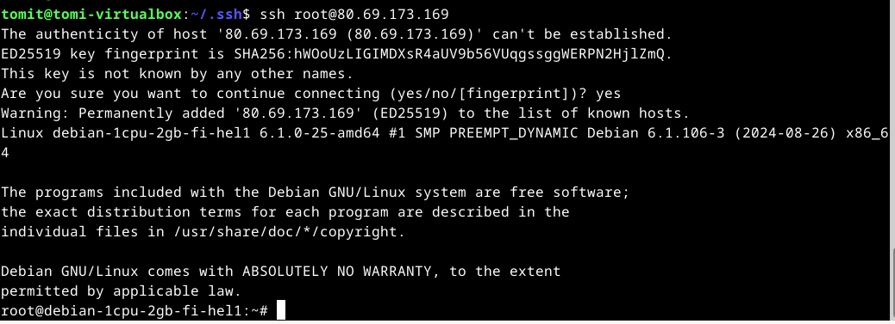

x) 
Susanna Lehto 22: Teoriasta käytäntöön pilvipalvelimen avulla (opiskelijan esimerkkiraportti)
  a. Pilvipalvelimen vuokraus ja asennus
  - Pilvipalvelin vuokrataan joltain palveluntarjoajalta, esim. Linode, DigitalOcean tai UpCloud.
  - Otetaan käyttöön hallintatyökalut ja etäyhteys käyttäen SSH:ta
  
  d. Palvelin suojaan palomuurilla
  - Konfiguroidaan palomuuri estämään luvattomat yhteydet palvelimelle

  e. Kotisivut palvelimelle
  - Siirretään jo luodut kotisivut palvelimelle
  - Konfiguroidaan palvelin

  f. Palvelimen ohjelmien päivitys
  - Muistetaan päivittää ohjelmia ja käyttöjärjestelmää säännöllisesti
  - Komennot, kuten sudo apt-get update ja upgrade

Karvinen 2012: First Steps on a New Virtual Private Server - an Example on DigitalOcean    

- Luodaan tili DigitalOceanin sivuille, valitaan serveri oikealle distrolle ja datakeskus mahdollisimman läheltä käyttäjää
- Asennetaan ssh ja otetaan yhteys ensimmäistä kertaa palvelimelle
- Peruskonfiguroinnit, kuten käyttäjätilin luominen, käyttäjän oikeudet, palomuurin käyttöönotto ja root-oikeuksien hallinta

  a.

  Aloitin luomalla UpCloud tunnukset,ja vuokrasin virtuaalipalvelimen
  

  Tän jälkeen latasin ssh sudo apt-install ssh, ja loin itselleni ssh avaimet
  

  Tämän jälkeen otin ssh:n avulla yhteyden virtuaalipalvelimeen
  

  b.

  Aloin tämän jälkeen säätämään tulimuurin kanssa, loin käyttäjäni serverille, annoin itselleni oikeudet, siirsin SSH-avaimet ja lukitsin ROOT tunnuksen

  
  
  
  

c. Käyttäen apache2 sain luotua virtuaalipalvelimelleni webbipalvelimen

ja näyttää toimivan.

Lähteet: https://terokarvinen.com/linux-palvelimet/ luettu 10.2
Susanna Lehto 22: Teoriasta käytäntöön pilvipalvelimen avulla (opiskelijan esimerkkiraportti) https://susannalehto.fi/2022/teoriasta-kaytantoon-pilvipalvelimen-avulla-h4/ Luettu 10.2
Karvinen 2012 https://terokarvinen.com/2017/first-steps-on-a-new-virtual-private-server-an-example-on-digitalocean/ Luettu 10.2
