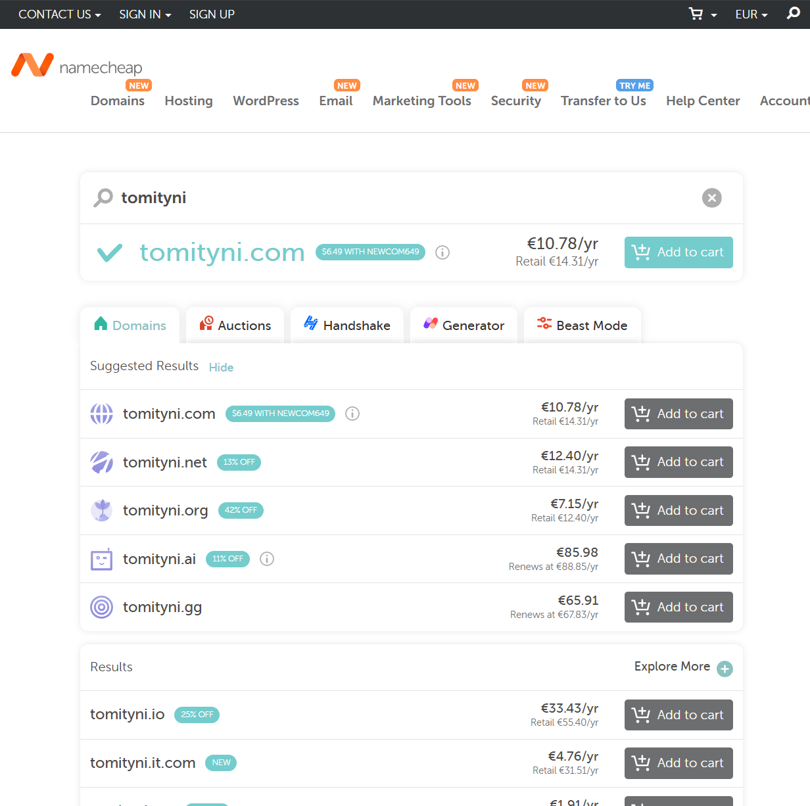

A. Domainin vuokraaminen NameCheapista

Aloitin etsimällä osoitetta NameCheapista, ja tomityni.com olikin vapaana.

Varmistin että kaikki on kunnossa ja käytin alekoodin

Seuraavaksi säädin Advanced DNS asetuksia samalla tavalla, kuin tunnilla näytettiin

B. ja C

Testataan toimiiko, www.tomityni.com toimii mutta tomityni.com ei

Tein tämän jälkeen konfiguraation sivuilleni, ja tomityni.com alkoi toimimaan

Tein kolmen erillisen alasivun kotisivun, jotka kopioin suoraan vanhasta työstäni "esimtesti" joka löytyy myös githubistani

Tältä se näyttää, ei kovin kaunis mutta toimii.

D.

E. Host ja Dig komennot

Minulta ei ennaltaan löytynyt Dig komentoa, joten päätin ladata sen, ja se kuului pakettii "dnsutils"

Käytin dig ja host komentoja kolmeen eeri sivuun: tomityni.com, namecheap.com ja google.com

Huomasin, että host komento on paljon laajempi kuin pelkkä dig. Esimerkiksi oman sivun kohdalla, host näyttää vain IP osoitteen ja mikä sivusto handlaa mailia.

Lähteet:
https://susannalehto.fi/2022/teoriasta-kaytantoon-pilvipalvelimen-avulla-h4/ 
https://terokarvinen.com/2017/first-steps-on-a-new-virtual-private-server-an-example-on-digitalocean/ 
https://httpd.apache.org/docs/2.4/vhosts/name-based.html 
[github.com/tomityni/esimtesti ](https://github.com/tomityni/esimtesti) 
