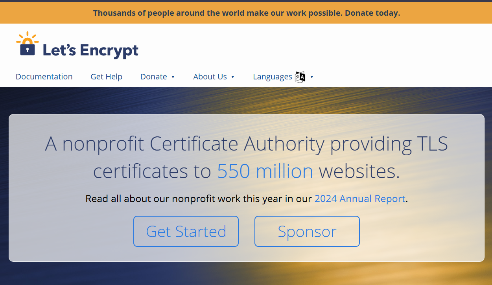
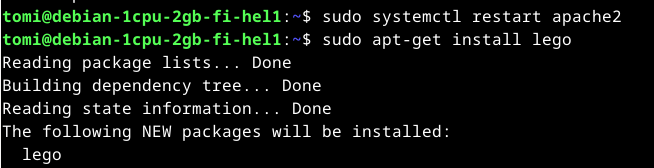
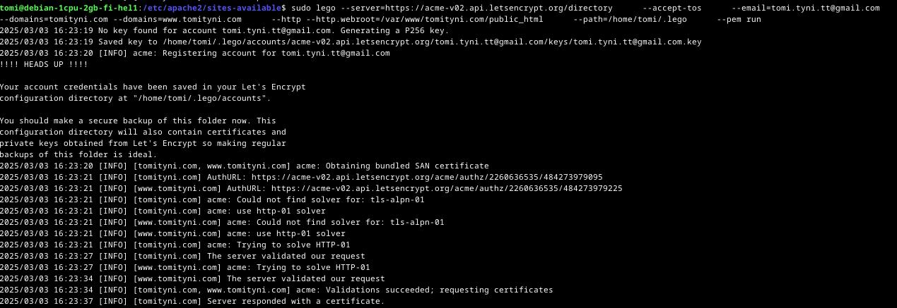
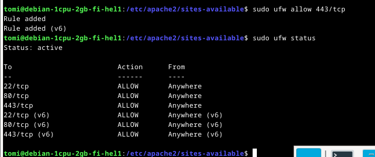
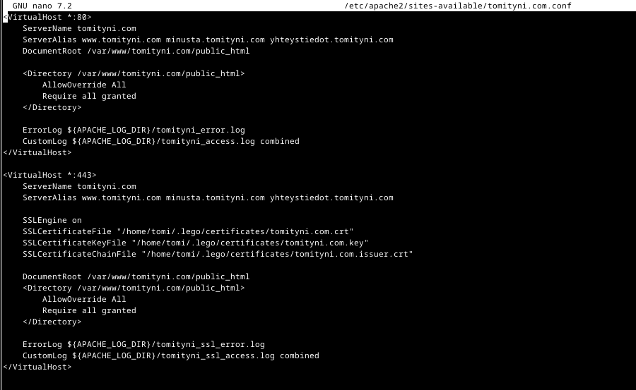
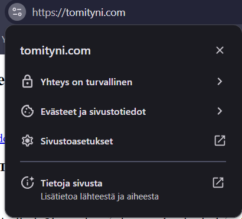
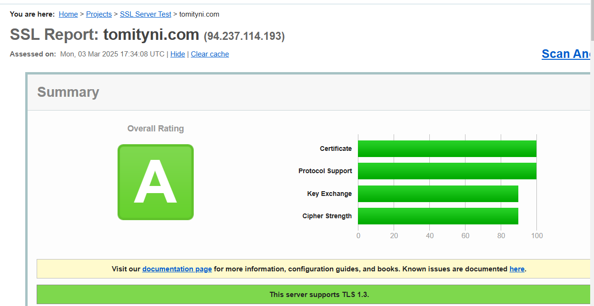

# h6 Salataampa
# x) Lue ja tiivistä. Tiivistelmäksi riittää muutama ranskalainen viiva per artikkeli. (Tässä alakohdassa ei tarvitse tehdä testejä tietokoneella)

## Let's Encrypt 2024: How It Works
Automaattisesti hallinnoi varmenteiden myöntämistä ja uusimista.
Käyttää ACME-protokollaa verkkotunnuksen omistajuuden vahvistamiseen ja varmenteiden asentamiseen.

## Lange 2024: Lego: Obtain a Certificate: Using an existing, running web server (vain tämä kappale, ei "Running a script afterward" tai myöhempiä)
Opastaa sertifikaatin hallintaa Lego nimisellä ohjelmalla.
Sertifikaatin käyttötapauksia on useampia, mutta kyseinen kappale keskittyy jo toiminnassa olevien verkkopalvelimien sertifiointiin

## The Apache Software Foundation 2025: Apache HTTP Server Version 2.4 [Official] Documentation: SSL/TLS Strong Encryption: How-To: Basic Configuration Example (Ei "Cipher Suites and Enforcing Strong Security" eteenpäin. Name based virtual host -tiedostossa tarvitset vain SSLEngine, SSLCertificateFile ja SSLCertificateKeyFile -asetukset)
Apache HTTP -palvelimen perus SSL/TLS -asetukset sisältävät SSL:n käytön (SSLEngine) ja varmenteen tiedoston (SSLCertificateFile) sekä yksityisavaimen tiedoston (SSLCertificateKeyFile) määrittämisen.
Nämä asetukset sisältyvät virtuaalipalvelimen kokoonpanoon turvallisten yhteyksien varmistamiseksi.

# a) Let's. Hanki ja asenna palvelimellesi ilmainen TLS-sertifikaatti Let's Encryptilta. Osoita, että se toimii. 
Aloitin menemällä Lets Encryptin sivuille, ja klikkaamalla etusivun bannerista "Get started"

 

Useimmissa tapauksissa hosting provider hakee ja hoitaa Lets encryptin sertifikaatit, mutta koska hallinnoimme serveriä itse, täytyy ne myös hakea itse. Työkaluna käytän Legoa, koska sitä käytiin läpi aikaisemmalla tunnilla. Avattua virtuaalikoneen, tein päivitykset, potkin hieman demonia ja aloitin asentamalla Legon komennolla sudo apt-get install lego

 

tämän jälkeen suoritin komennon sudo lego --server=https://acme-v02.api.letsencrypt.org/directory      --accept-tos      --email=tomi.tyni.tt@gmail.com      --domains=tomityni.com --domains=www.tomityni.com      --http --http.webroot=/var/www/tomityni.com/public_html      --path=/home/tomi/.lego      --pem run

 

Tämä näytti toimivan, Lego loi kaikki sertifikaatit /home/tomi/.lego/certificates/ directoryyn.

Muistin myös avata 443/tcp väylän

 

Seuraavaksi lisäsin VirtualHost 443 konffiksen /etc/apache2/sites-available/tomityni.com.conf

 

Tämän jälkeen aktivoin SSL:n komennolla sudo a2enmod ssl, ja testasin konffiksen sudo apache2ctl. Se vastasi "Syntax OK". Käynnistin apachen uudelleen, ja käväisin sivuilla kurkkaamassa, toimiko.

 

Ja näyttäisi toimivan!

# b) A-rating. Testaa oma sivusi TLS jollain yleisellä laadunvarmistustyökalulla, esim. SSLLabs (Käytä vain tavanomaisia tarkistustyökaluja, ei tunkeutumistestausta eikä siihen liittyviä työkaluja)

Tässä tehtävässä laadunvarmistustyökaluna käytin https://ssllabs.com 

 

Ja tämä antoi arvosanaksi A

# Lähteet

https://terokarvinen.com/linux-palvelimet/#h6-salataampa Luettu 3.3.2025
https://letsencrypt.org/how-it-works/ Luettu 3.3.2025
https://go-acme.github.io/lego/usage/cli/obtain-a-certificate/index.html#using-an-existing-running-web-server Luettu 3.3.2025
https://httpd.apache.org/docs/2.4/ssl/ssl_howto.html#configexample Luettu 3.3.2025
